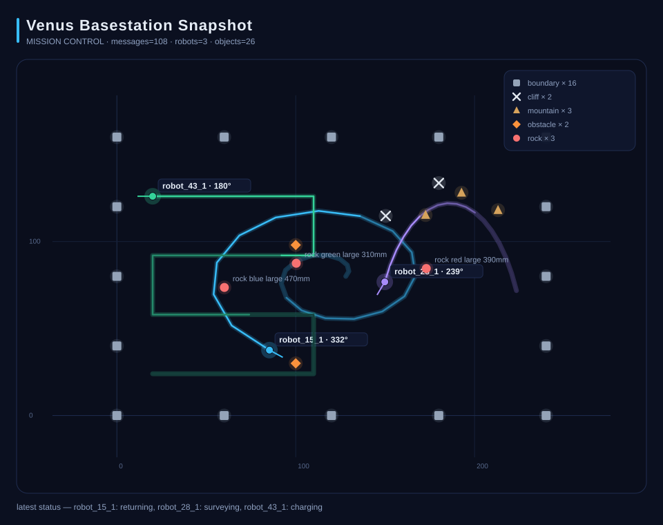

<p align="center">
  <strong>Venus Basestation</strong>
</p>

<p align="center">
  Base-station software and visualization dashboard for a multi-robot planetary exploration system.
  Receives robot telemetry over MQTT, maintains a live world model, and renders explored terrain in real time.
</p>

<p align="center">
  
  
  
  
</p>

<p align="center">
  
</p>

---

## Overview

This repository contains two things:

- **`user-interface-module/`** — the computer software and UI module: Python base-station, MQTT subscriber, JSONL replay, map state engine, Tkinter desktop dashboard, SVG/PNG export, and automated tests.
- **`team-project/`** — a snapshot of the shared team codebase (PYNQ embedded software, communication module, algorithm/navigation module, mapping module) mirrored from the team GitLab for portfolio context.

The team GitLab remains the authoritative source for coursework collaboration. This repository is a public portfolio mirror.

---

## Architecture

```
robot hardware (PYNQ)
  └─ embedded software module
       └─ communication module  ──MQTT──▶  venus_basestation
                                              ├─ message_schema   (parse + validate)
                                              ├─ map_state        (world model)
                                              ├─ theme            (shared design tokens)
                                              ├─ tk_dashboard     (mission-control Tkinter UI)
                                              ├─ dashboard        (matplotlib export)
                                              └─ svg_snapshot     (stdlib SVG export)
```

In live MQTT mode the paho network loop runs on a daemon thread and only
*enqueues* events; the Tk thread drains the queue at ~30 fps, so no widget is
ever touched from a background thread.

### Mission Control dashboard

The default `--ui tk` dashboard is a dark mission-control console (stdlib
Tkinter, zero extra dependencies):

- **Live terrain map** — world-coordinate grid with adaptive 1/2/5 step,
  fading glow trails per robot, heading arrows, detection markers with halos.
- **Zoom / pan / fit** — mouse wheel zooms around the cursor, drag pans,
  double-click (or `F`) refits to the data.
- **Robot status cards** — mode, battery bar with level colors, position,
  heading, and latest color/distance sensor readings per robot.
- **Detection chips & color-coded mission log** — running tallies and the
  latest events, tinted by event type.
- **KPI header** — connection pill, mission clock, message count, link rate.
- **Toolbar** — pause/resume (`Space`), fit view (`F`), export SVG snapshot
  (`S`) straight from the live view.
- **Themes** — `--theme dark` (default) or `--theme light`, shared with the
  SVG exporter.

### Robot command uplink

Per the Team 28 embedded spec, the robot subscribes to
`/pynqbridge/<username>/recv` and applies commands **at the end of its active
execution iteration step**. The base station publishes these QoS 1 payloads:

| Command | Payload | Effect |
|---------|---------|--------|
| Start | `{"command":"start","arguments":["--verbose"]}` | Exit the initial IDLE hold / resume navigation |
| Idle | `{"command":"idle","arguments":[]}` | Break the loop safely, park motors, wait for resume |
| E-Stop | `{"command":"stop","arguments":[]}` | Halt loops, tear down peripherals, terminate the embedded app |

In live MQTT mode the dashboard shows a **COMMAND UPLINK** panel
(START / IDLE / E-STOP). Button feedback confirms the *send* only — actual
robot state is confirmed by returning telemetry. The command topic is derived
from the username (`robot_43_1` → `/pynqbridge/robot_43_1/recv`) and can be
overridden with `VENUS_MQTT_COMMAND_TOPIC` or `--command-topic`.

Headless one-shot command (demo prep / scripting):

```bash
PYTHONPATH=src python -m venus_basestation --source mqtt --send-command start
PYTHONPATH=src python -m venus_basestation --source mqtt --send-command stop --command-topic /pynqbridge/robot_43_1/recv
```

**Input sources** (selectable at runtime):

| Source | Flag | Description |
|--------|------|-------------|
| Simulated | `--source simulated` | Built-in fake message generator |
| JSONL replay | `--source jsonl` | Replay a recorded `.jsonl` file |
| Live MQTT | `--source mqtt` | Subscribe to broker topics |

---

## Connect to the robot (live) — start here

If the dashboard only shows **simulated example data**, it just means no
credentials are configured yet. To connect to the real robot:

1. `cd user-interface-module`
2. Copy `.env.example` to `.env` and set your board credentials:
   ```
   VENUS_MQTT_USERNAME=robot_43_1
   VENUS_MQTT_PASSWORD=<your board password>
   ```
   (Leave the topic unset — it is derived as `/pynqbridge/robot_43_1/send`.)
3. Launch:
   ```powershell
   .\run-dashboard.ps1
   ```
   or directly: `PYTHONPATH=src python -m venus_basestation` — with credentials
   set it **auto-connects** (no `--source` needed). With no credentials it
   prints how to connect and falls back to simulated data.

Verify the broker login without opening a window:

```powershell
PYTHONPATH=src python -m venus_basestation --mqtt-check --mqtt-min-messages 0
```

> If it connects but the map stays empty (`processed 0 messages`), the broker
> link is fine but **nothing is publishing** to your topic yet. The robot
> firmware only writes telemetry over UART, so something must relay UART→MQTT.
> Either the course pynqbridge/ESP32 relay does this (then just run the
> firmware), or run the bundled fallback bridge **on the PYNQ**:
> `tools/uart_mqtt_bridge.py` (reads the firmware's framed JSON from a serial
> port and republishes to `/pynqbridge/<username>/send`; confirm the serial
> device first). See `user-interface-module/docs/verification-and-responsibility-boundary.md`.

## Quick Start

```bash
cd user-interface-module
python -m venv .venv
source .venv/bin/activate          # Windows: .venv\Scripts\Activate.ps1
pip install -r requirements.txt
# Connect to the robot (credentials in .env) — auto-selects MQTT:
PYTHONPATH=src python -m venus_basestation
# Or explicitly choose a source:
PYTHONPATH=src python -m venus_basestation --source simulated
```

Replay the bundled three-robot demo mission (the scene shown above):

```bash
PYTHONPATH=src python -m venus_basestation --source jsonl --jsonl-path examples/demo_mission.jsonl
```

Headless smoke run (no window):

```bash
PYTHONPATH=src python -m venus_basestation --source simulated --headless --steps 20
```

Replay a recorded session:

```bash
PYTHONPATH=src python -m venus_basestation \
  --source jsonl \
  --jsonl-path examples/sample_messages.jsonl \
  --headless \
  --save-state outputs/state.json
```

Connect to a live MQTT broker (explicit form; the `.env` flow above is simpler):

```bash
export VENUS_MQTT_HOST=mqtt.ics.ele.tue.nl
export VENUS_MQTT_USERNAME=robot_15_1
export VENUS_MQTT_PASSWORD=<password>
# topic is derived from the username — no need to set VENUS_MQTT_TOPICS
PYTHONPATH=src python -m venus_basestation --source mqtt --ui tk
```

The pynqbridge addresses each board by its **full username**, e.g.
`/pynqbridge/robot_15_1/send` for `robot_15_1` and `/pynqbridge/robot_43_1/send`
for `robot_43_1` (matching Team 28's robot publisher). If `VENUS_MQTT_TOPICS`
is not set, the base station derives this topic from `VENUS_MQTT_USERNAME`, so
the simplest correct setup is to leave it unset.

Verify broker connectivity without opening the UI:

```bash
PYTHONPATH=src python -m venus_basestation \
  --source mqtt --headless --mqtt-check --mqtt-timeout 15 --mqtt-min-messages 0 \
  --save-state outputs/mqtt_check.json
```

Use `--mqtt-min-messages 0` to verify broker login and topic subscription even
when the robot is not publishing. Use the default minimum of `1` when you want
to verify live robot payloads too.

Export a PNG dashboard snapshot:

```bash
pip install -r requirements-dashboard.txt
MPLBACKEND=Agg PYTHONPATH=src python -m venus_basestation \
  --source jsonl \
  --jsonl-path examples/sample_messages.jsonl \
  --headless \
  --save-figure outputs/dashboard.png
```

Export an SVG snapshot (no extra dependencies):

```bash
PYTHONPATH=src python -m venus_basestation \
  --source jsonl \
  --jsonl-path examples/sample_messages.jsonl \
  --headless \
  --save-figure outputs/dashboard.svg
```

---

## CLI Reference

```
python -m venus_basestation [options]

--source {simulated,mqtt,jsonl}   Input source (default: simulated)
--headless                        Run without opening a window
--ui {tk,matplotlib}              Dashboard backend (default: tk)
--theme {dark,light}              Dashboard + SVG theme (default: dark)
--steps N                         Simulated steps to run (default: 40)
--delay SECS                      Delay between simulated steps (default: 0.05)
--jsonl-path PATH                 JSONL file for --source jsonl
--save-figure PATH                Write final figure to PNG or SVG
--save-state PATH                 Write final map state to JSON
--mqtt-check                      Verify broker config and exit
--mqtt-timeout SECS               Timeout for --mqtt-check / --send-command (default: 10)
--mqtt-min-messages N             Minimum messages for --mqtt-check (default: 1)
--send-command {start,idle,stop}  Publish one robot command and exit
--command-topic TOPIC             Override the robot command topic
```

---

## Message Format

The base-station accepts JSON messages with the following canonical fields:

```json
{
  "robot_id": "robot_43_1",
  "event_type": "rock",
  "x": 1.23,
  "y": 4.56,
  "color": "red",
  "size": "large",
  "distance_mm": 320.0,
  "confidence": 0.91
}
```

**Supported event types:** `robot_position`, `rock`, `cliff`, `boundary`, `mountain`, `obstacle`, `status`, `color_sensor`, `distance_sensor`

The parser normalizes common field name variants from the communication module (e.g. `type=position_update` → `event_type=robot_position`, `object_distance_mm` → `distance_mm`). See [`docs/message-format.md`](user-interface-module/docs/message-format.md) for the full contract.

The current Team 28 UART test sends robot-to-ESP32 messages as `4-byte payload length + JSON payload bytes`. MQTT normally forwards only the JSON body, but the parser also accepts MQTT payloads where that 4-byte UART length prefix is still present.

---

## MQTT Environment Variables

| Variable | Description |
|----------|-------------|
| `VENUS_MQTT_HOST` | Broker hostname |
| `VENUS_MQTT_PORT` | Broker port (default: 1883) |
| `VENUS_MQTT_USERNAME` | Username |
| `VENUS_MQTT_PASSWORD` | Password — never commit this |
| `VENUS_MQTT_TOPICS` | Comma-separated telemetry topic list |
| `VENUS_MQTT_COMMAND_TOPIC` | Robot command topic (default: derived `/pynqbridge/<username>/recv`) |

---

## Project Layout

```
user-interface-module/
  src/venus_basestation/
    __main__.py          CLI entry point and run loop
    message_schema.py    Message parsing, validation, field normalization
    map_state.py         In-memory world model (robots, objects, events)
    theme.py             Shared design tokens (dark/light, blend math)
    tk_dashboard.py      Mission-control Tkinter UI (thread-safe queue pump)
    dashboard.py         Matplotlib visualization and PNG export
    svg_snapshot.py      Themed SVG export (stdlib only, no matplotlib)
    mqtt_client.py       MQTT subscriber wrapper
    fake_messages.py     Simulated robot observations
    io_utils.py          JSONL reader and state writer
  docs/
    assets/mission-dashboard.svg
    message-format.md
    team28-current-interface.md
    verification-and-responsibility-boundary.md
  examples/
    demo_mission.jsonl   Deterministic three-robot demo scene
  tests/
  tools/
    generate_demo_mission.py
    tk_smoke.py          Local windowed smoke test (+ optional screenshot)

team-project/
  libpynq-5EID0-2023-v0.3.0/    Shared PYNQ course library
  module-branches/               Snapshots of all team modules
  README.md                      Original team development guide
  PROVENANCE.md
```

---

## Running Tests

```bash
cd user-interface-module
pip install -r requirements-dev.txt
python -m pytest -v
```

---

## Development

Generate a fake JSONL stream for offline testing:

```bash
PYTHONPATH=src python tools/generate_fake_jsonl.py outputs/fake.jsonl --count 60
```

---

## Safety

- Do not commit MQTT credentials, `sftp.json`, `.venv/`, or generated output files.
- Use environment variables for all runtime secrets.
- The `--mqtt-check` flag prints sanitized config and never prints the password value.

---

## License

Original code in `user-interface-module/` is MIT licensed. The `team-project/` snapshot retains the original team licensing. See [`LICENSE`](LICENSE) and [`team-project/PROVENANCE.md`](team-project/PROVENANCE.md).
